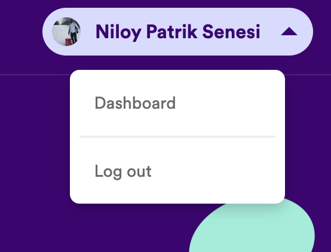

This is a [Next.js](https://nextjs.org/) project bootstrapped with [`create-next-app`](https://github.com/vercel/next.js/tree/canary/packages/create-next-app).

## Getting Started

Run the command to install dependencies:

npm i or npm install

Run the development server:

```bash
npm run dev
# or
yarn dev
# or
pnpm dev
# or
bun dev
```

Open [http://localhost:3000](http://localhost:3000) with your browser to see the result.

## Environment variables

- Create an .env file in your project/root

CLIENT_ID = 

CLIENT_SECRET = 

REDIRECT_URI = http://localhost:3000/

NEXT_PUBLIC_OPENAI_API_KEY = 

## Setting up API keys

Setting up for Spotify

- Visit the Spotify developer website:

https://developer.spotify.com/

- Sign into your account

- Click the dropdown menu on the right-hand side and select dashboard as shown below

    

- Select "Create app" and fill out the necessary information

- Make sure to add http://localhost:3000/ in the "Redirect URIs" section

-Once done, head over to newly created app and select settings to gain access to your client and secrete keys.

Setting up for chatbot

- Head over to the Open AI website and register/ login

https://openai.com/blog/introducing-chatgpt-and-whisper-apis 

- Do to their API documentation 

- On left-hand side, there will be a navigation menu

- Select the API keys option 

- Create your new secrete API key 

- Add the screte key to the following value in your .env file:

NEXT_PUBLIC_OPENAI_API_KEY

## Learn More

To learn more about Next.js, take a look at the following resources:

- [Next.js Documentation](https://nextjs.org/docs) - learn about Next.js features and API.
- [Learn Next.js](https://nextjs.org/learn) - an interactive Next.js tutorial.

You can check out [the Next.js GitHub repository](https://github.com/vercel/next.js/) - your feedback and contributions are welcome!

## Deploy on Vercel

The easiest way to deploy your Next.js app is to use the [Vercel Platform](https://vercel.com/new?utm_medium=default-template&filter=next.js&utm_source=create-next-app&utm_campaign=create-next-app-readme) from the creators of Next.js.

Check out our [Next.js deployment documentation](https://nextjs.org/docs/deployment) for more details.

------
## 

